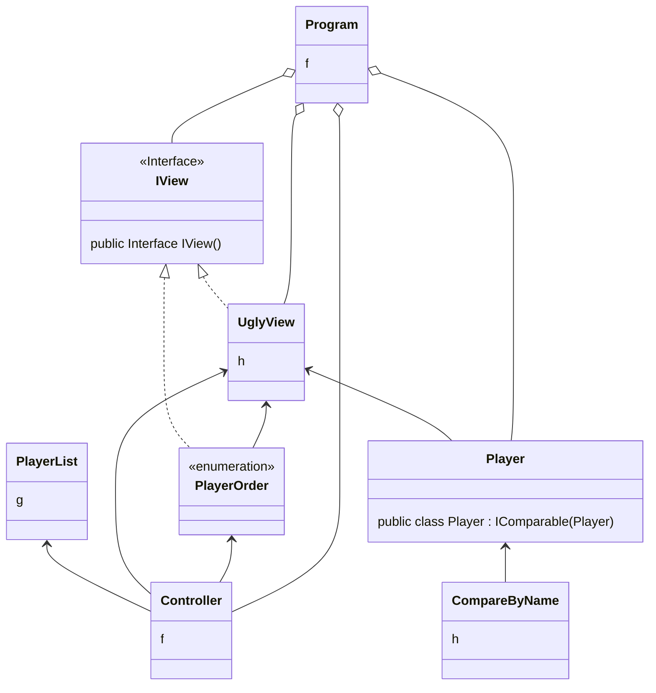

## Mermaid Diagram

```mermaid
classDiagram

IView <|..PlayerOrder
IView <|.. UglyView
UglyView <--Player
UglyView < -- PlayerOrder
PlayerList < -- Controller
UglyView <-- Controller
PlayerOrder <-- Controller
Player <-- CompareByName
Program o--Controller
Program o--IView
Program o--UglyView
Program o--Player


class IView{
    <<Interface>>

   public Interface IView()
}

class UglyView{

h

}

class CompareByName{

    h
    
}

class PlayerList{

    g

}

class Controller{
f
    

}

class PlayerOrder{

 <<enumeration>>

}

class Player{

public class Player : IComparable(Player)

}

class Program{

f

}


```