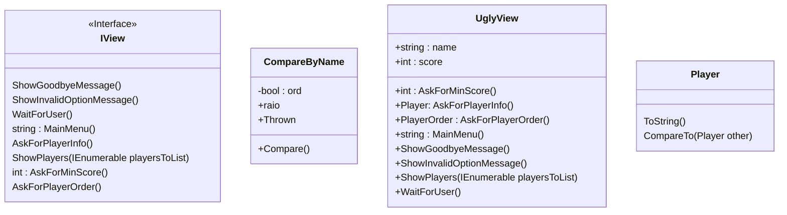

## Mermaid Diagram

```mermaid
classDiagram


class IView{
    <<Interface>>

    ShowGoodbyeMessage()
    ShowInvalidOptionMessage()
    WaitForUser()
    string : MainMenu()
    AskForPlayerInfo()
    ShowPlayers(IEnumerable<Player> playersToList)
    int : AskForMinScore()
    AskForPlayerOrder()
}


class CompareByName{
    -bool : ord
    +raio
    +Thrown
    +Compare()
}


class UglyView{

    +string : name
    +int : score
    +int : AskForMinScore()
    +Player: AskForPlayerInfo()
    +PlayerOrder : AskForPlayerOrder()
    +string : MainMenu()
    +ShowGoodbyeMessage()
    +ShowInvalidOptionMessage()
    +ShowPlayers(IEnumerable<Player> playersToList)
    +WaitForUser()
}


class Player{

ToString()
CompareTo(Player other)

}

    


```